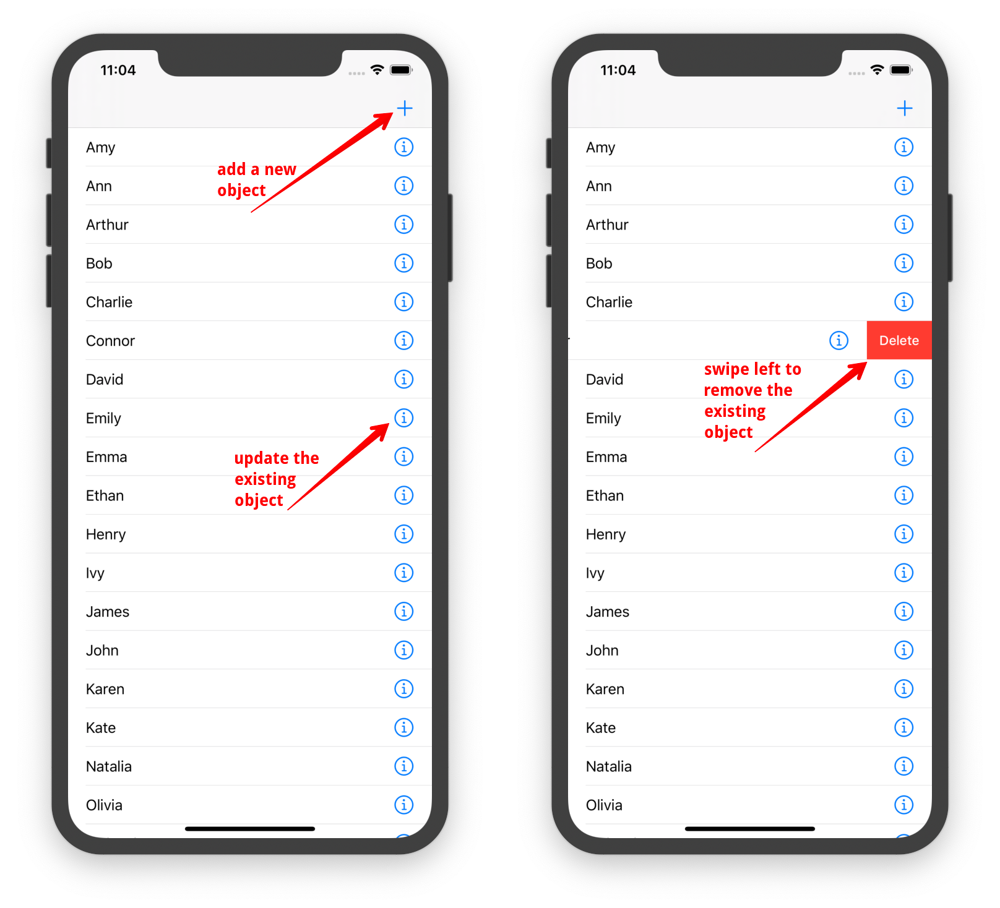

This is the sample project that demonstrates usage of the BackendlessDataCollection class binded to UITableView.

**Preparations:**
1) You shold have the `Person table with the `name` column in your database (sample uses it as a model).


2)  After downloading this project open Terminal and go to the root folder and install cocoapods dependency:

```
pod install / pod update
```

Make sure the version of the installed Backendless SDK is 5.7.2 or higher.

3) Open the .xcworkspace and go to the AppDelegete.swift.
Change the Application Id and iOS API secret values for your project's ones.

Everything is prepared for work.

As you can see, the `Person.swift` class confroms to the `Identifiable` protocol.

BackendlessDataCollection named `people` in the TableViewController.swift is binded to UITableView.
This sample project provides functionality to create new Person object or update/delete the existing one:


